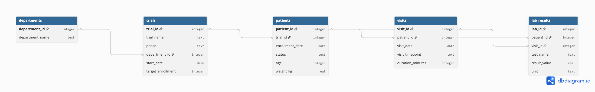

# Clinical Data SQL Portfolio

This repository demonstrates applied SQL and analytical skills using simulated clinical research datasets.

The goal is to model real-world healthcare operations questions including:

- Trial enrollment tracking
- Patient visit analysis
- Operational KPI reporting
- Study performance monitoring

This portfolio reflects the type of analytical work performed in Clinical Operations, Research Coordination, and Healthcare Systems roles.

---

## 📊 Project Structure

```
schema/         → Database schema definition
seed_data/      → Sample healthcare data inserts
queries/        → Analytical SQL queries
case_studies/   → Business-style analysis summaries
dashboards/     → Excel-based KPI dashboards
```

---

## 🧱 Database Design

The simulated dataset includes tables such as:

- patients
- trials
- visits
- departments

The schema was intentionally designed to mirror common clinical research structures.

## Database Schema

[View Schema Diagram](docs/clinical_db_schema.pdf)


---

## 🔍 Example Analytical Questions Answered

- What is the enrollment rate per trial?
- Which departments have declining patient participation?
- What is the average number of visits per enrolled patient?
- Which trials have low recruitment activity?

Each question is answered using structured SQL queries inside the `/queries` directory.

---

## 🛠 Technologies Used

- SQL (SQLite syntax)
- Excel (Pivot Tables, KPI modeling)
- Git / GitHub for version control

---

## 🎯 Purpose

This repository is part of my transition into Clinical Data / Healthcare Analytics roles, combining:

- Domain expertise in research operations
- Technical SQL skills
- Analytical problem-solving
- Clear documentation of insights

---

## 👩‍⚕️ Author

Mary Kasparian
Clinical Operations Professional | SQL | Healthcare Analytics
